

  <h3 align="center">Meu Rolê</h3>
  
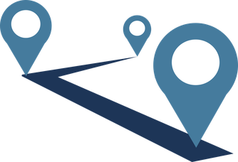

  

    Trabalho de conclusão do curso de Android
     
     
    FIAP - MBA - MOBILE DEVELOPMENT
     
    APPS, IOT, CHATBOTS & VIRTUAL ASSISTANTS
     
  

## Indice

- [Integrantes](#integrantes)
- [Professor](#professor)
- [Requisitos](#requisitos)
- [Ambiente](#ambiente)

## Integrantes
- [Helton Isac](https://github.com/helton-isac)
- [Helton Souza](https://github.com/heltonss)
- [Lyan Masterson](https://github.com/lyanmaster)
- [Ricardo Kerr](https://github.com/RicardoKerr)

## Professor
- [Heider Lopes](https://github.com/heiderlopes)

## Requisitos

### Requisito 1 - Tela de SplashScreen (Opcional)
- Essa tela deverá conter o logotipo da aplicação e uma animação.

| Splash para Login                                    | Splash para Home                                    |
|------------------------------------------------------|-----------------------------------------------------|
||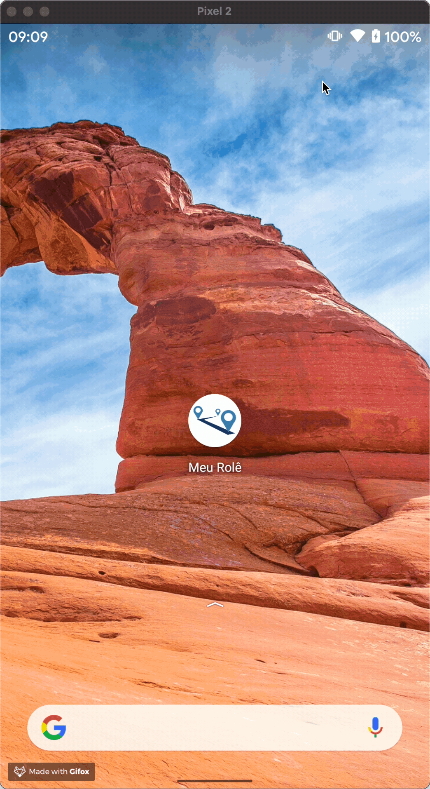|

### Requisito 2 - Tela de Login
- Validar os dados do usuário através de um serviço. O usuário deverá poder criar uma conta.
- - Conta criada no Firebase com método de autenticação por email e senha
- Permitir que o usuário possa se manter conectado.
- - Caracteristica do Firebase. Para se deslogar o usuário deve clicar em Sair na tela de Perfil.
- Opcional - desafio:​ Adicionar Fingerprint para login
- - Após o primeiro login por e-mail e senha o usuário é questionado se deseja cadastrar a biometria para facilitar seu acesso na próxima vez. A biometria foi implementada em uma lib separada para atender outro requisito.

| Criar conta 01                                              | Criar conta 02                                              |
|-------------------------------------------------------------|-------------------------------------------------------------|
|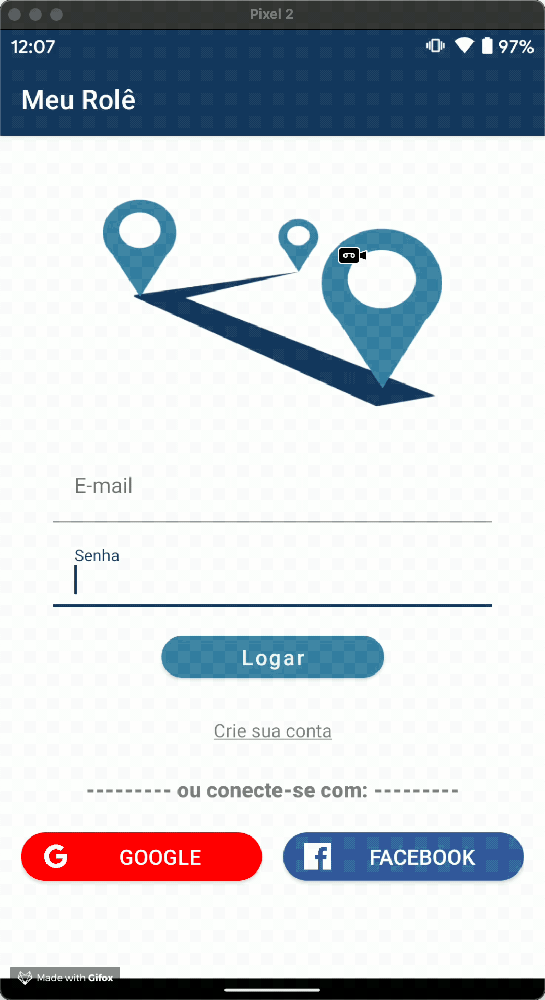|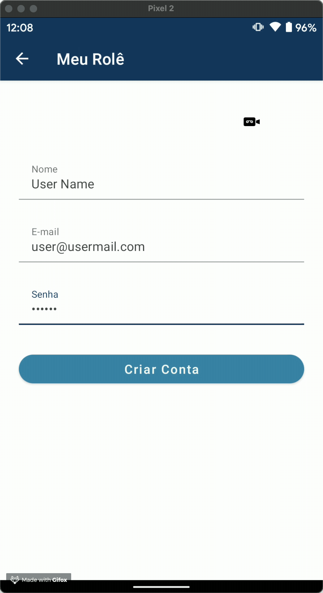|

|Login com e-mail e senha                                 | Cadastro da Biometria no Primeiro Login                        | Login por biometria                                      |
|---------------------------------------------------------|----------------------------------------------------------------|----------------------------------------------------------|
|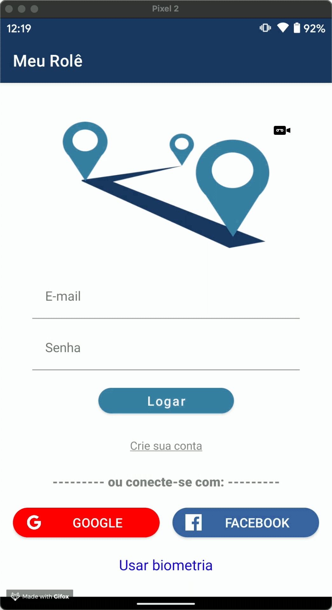|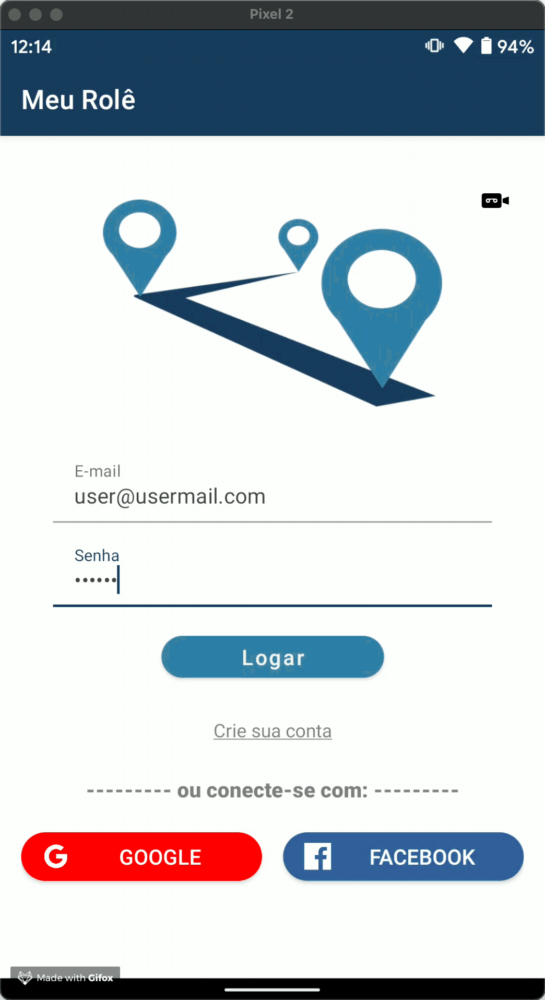|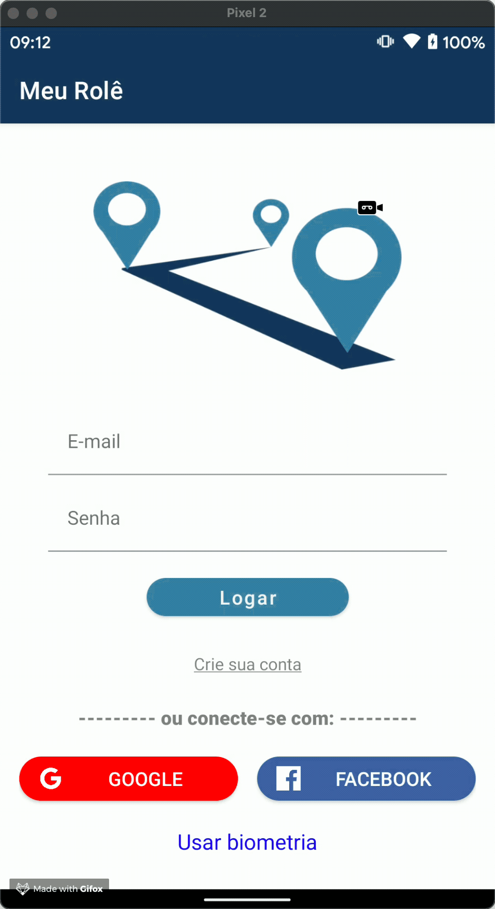|

### Requisito 3 - Tela Principal
- Essa tela deverá conter um NavigationView ou BottomNavigationView que irá abrir as demais telas e também finalizar a aplicação.
- - Optamos por um BottomNavigationView

Após o login usuario será levado para tela principal, onde podera escolher entre buscar roteiros, criar um roteiro ou fazer uma pesquisa no mapa (Google Maps).

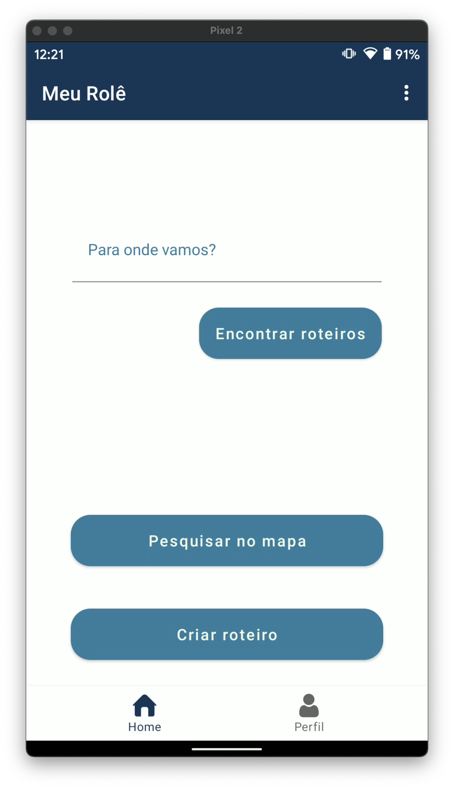

### Requisito 4 – Tela de Cadastro
- O aplicativo deverá conter pelo menos uma tela para realizar cadastro. As informações a serem cadastradas ficam livre para o aluno escolher. Por exemplo: cadastro de imóveis visitados, loja com determinados produtos desejados.
- - Foi criada duas telas para a criação de roteiro. O roteiro possui nome, descrição e uma lista de pontos de interesse. 
- - Utilizamos a API do places para facilitar a busca de atrações no mapa.
- - Incluimos um botão para realizar ligação nessa tela para atender o requisito.

| Criação de um roteiro (Places API)                          | Criação de um ponto de interesse no roteiro (ligação telefonica) |
|-------------------------------------------------------------|------------------------------------------------------------------|
||     |

### Requisito 5 – Tela Lista de Exibição dos Dados
- Utilizar o RecyclerView para exibir os dados gravados na tela anterior. 
- O usuário poderá realizar a exclusão do registro através da lista.

Tela de Lista de roteiros
Tela de Lista de Pontos de Interesse com exclusão de items

| Lista de Roteiros                                    | Lista de Pontos de Interesse com exclusão de items |
|------------------------------------------------------|----------------------------------------------------|
||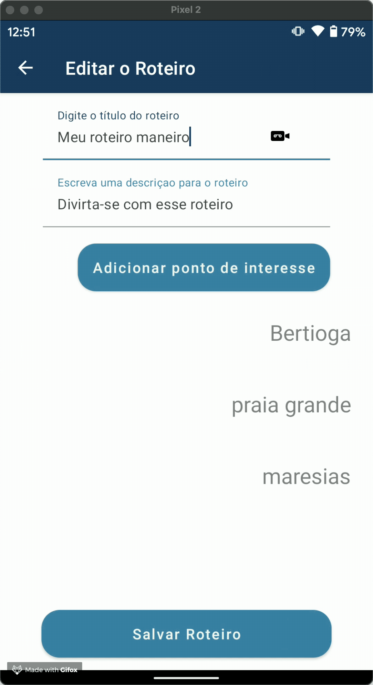|

### Requisito 6 – Tela de Edição dos dados
- Através do RecyclerView (Funcionalidade 5) o usuário poderá abrir a tela de edição e realizar a alteração dos dados.

O usuario pode editar um ponto de interesse criado ainda dentro da tela de criação de roteiros ou editar um roteiro quando olhando a lista de roteiros.

| Edição de Roteiros                                     | Edição de ponto de interesse                     |
|--------------------------------------------------------|--------------------------------------------------|
|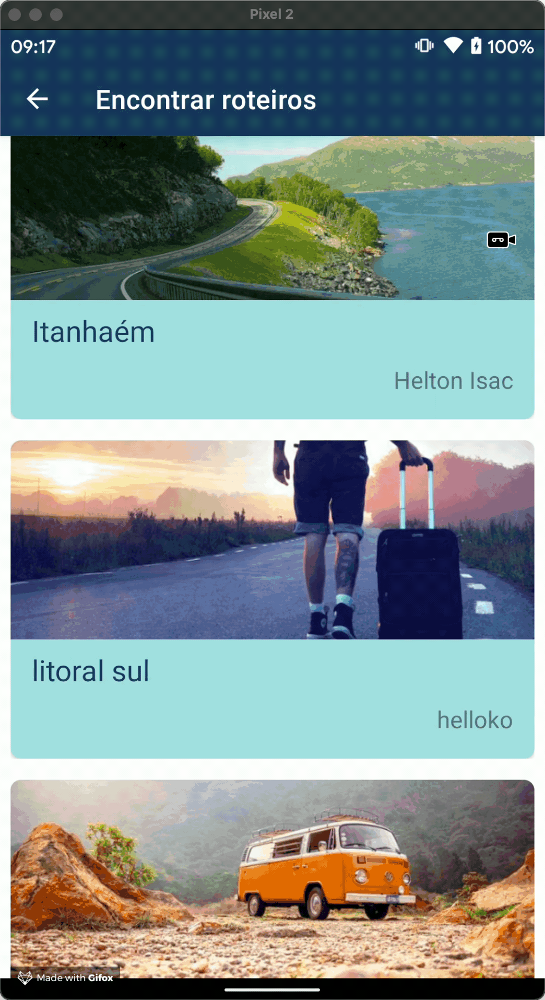|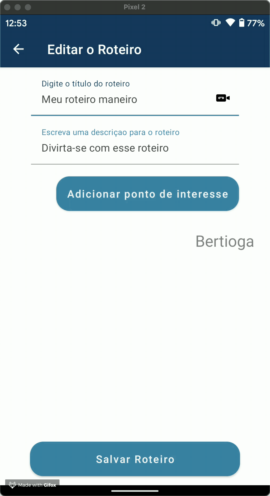|

### Requisito 7 – Tela de Sobre
- A tela deverá conter: Logo do aplicativo, Nome do Desenvolvedor e Versão do Aplicativo

O usuario pode encontrar informações dos desenvolvedores e sobre o aplicativo na tela de sobre. Ela fica na aba de perfil.

Aproveitamos para atender o requisito de compartilhamento nessa tela, compartilhando o próprio app.

| Tela de About com compartilhamento                  |
|-----------------------------------------------------|
|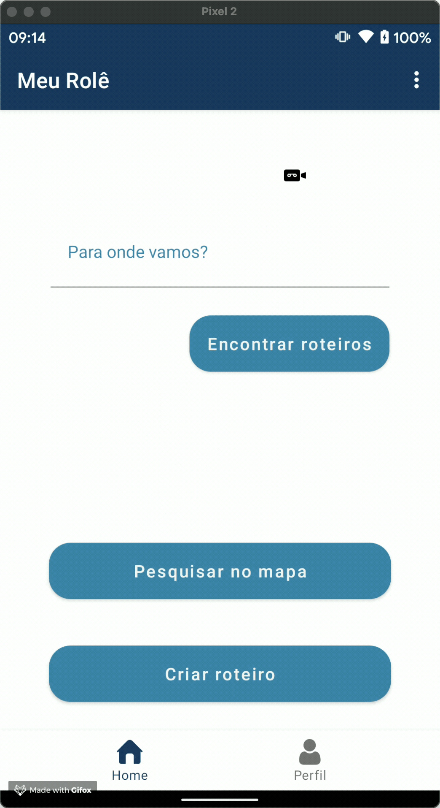|

### Requisito 8 - Tela de Mapa
- A aplicação deverá ter um mapa e mostrar pelo menos uma coordenada. Por exemplo: ponto do estabelecimento, pontos de vendas, pontos de exposições. Ou utilizar mapa através de intent.

| Tela de Mapa e search                              |
|----------------------------------------------------|
||

### Requisito 9 - Integração de recursos
- O aplicativo deverá implementar as seguintes funcionalidades:
- Realizar ligação
- - Atendido junto com o requisito 6
- - É possível realizar ligação pelo telefone cadastrado no ponto de interesse.
- Compartilhar conteúdo
- - Atendido junto com o requisito 7
- - É possível tambem realizar compartilhamento do aplicativo na tela de sobre.

### Requisito 10 - Push Notification
- O aplicativo deverá receber notificações via PUSH pelo Firebase. Deverá exibir a mensagem utilizando o Notification. Ao clicar sobre a notificação o usuário deverá ser direcionado para o aplicativo.

O aplicativo receberá push notifications para encorajar o usuario de encontrar um novo roteiro.

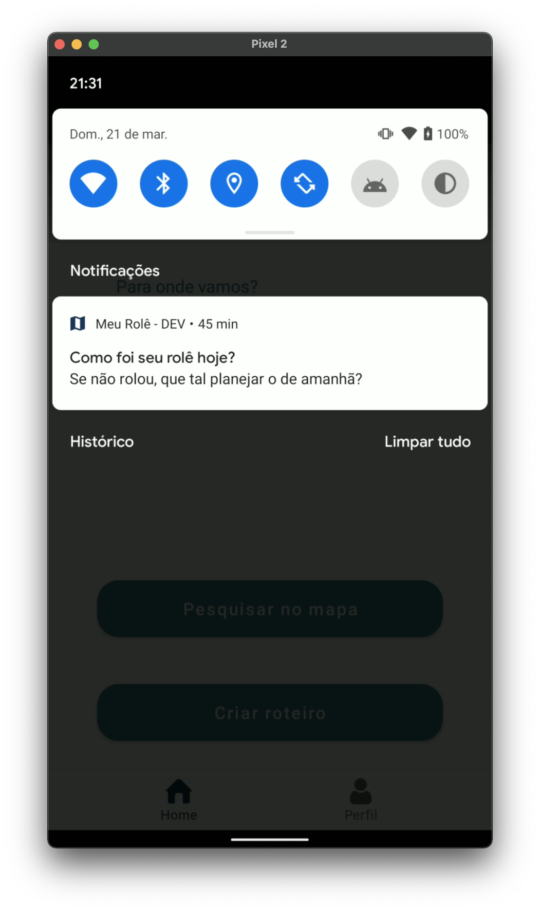

### Requisito 11 - Analytics
- O aplicativo deverá enviar informações pertinentes para análise de uso do aplicativo.

No analytics estamos observando eventos de share, signup, e alguns custom como attempt_to_google_signin entre outros 

### Requisito 12 - Crashlytics
- Visando à qualidade do aplicativo, os crash deverão ser enviados para o Firebase Crashlytics.

Todos os crashes que acontecerem no aplicativo aparecerão no painel do Crashlytics tanto em prod como em dev.

### Requisito 12 - Firebase App Distribution
Foi adicionado o professor como tester do aplicativo.

### Requisito 13 - Product Flavors
Flavors foram criados para separar o ambiente de desenvolvimento e produção.

### Requisito 14 - Criação de uma biblioteca
Foi criada uma biblioteca para realizar a biometria
- https://github.com/helton-isac/SimpleBiometricAPI
- https://jitpack.io/#helton-isac/SimpleBiometricAPI

### Requisito 15 - Remote Config
- Adicionar configurações remotas no Firebase.

Utilizamos as Remote Configs para exibir o slogan na tela de about e para controlar a visibilidade dos botões experimentais de Login com Google e Facebook.

## Ambiente

- Para compilar o projeto localmente você precisa criar uma chave de API do google Maps, e ativar também a API do Places.
- A conta do google cloud deve possuir o faturamento valido e habilitado por conta do Places API.
- Também é necessário realizar alterações para utilizar o firebase, criando o seu próprio google-play-services.json

- Para rodar a api de mapas, adicione a secret_key dentro do arquivo local.properties
- - >MAPS_API_KEY=secret-key
- - https://developers.google.com/maps/documentation/android-sdk/get-api-key